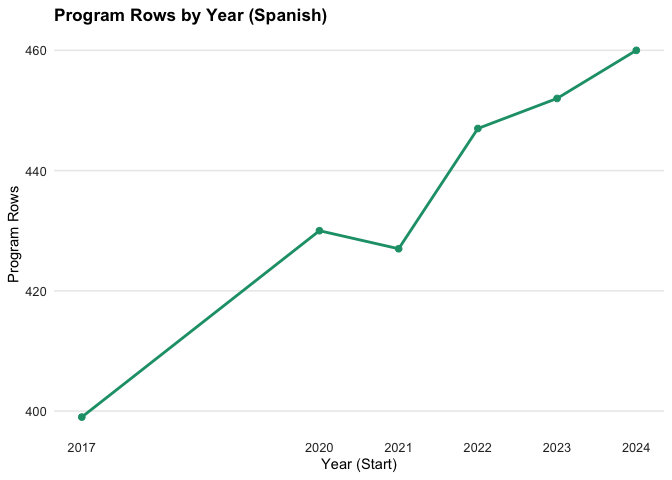
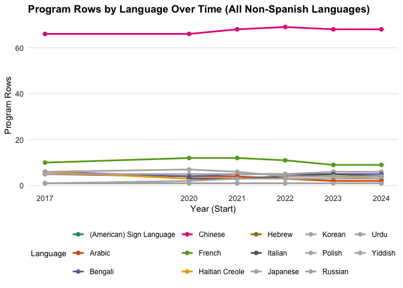
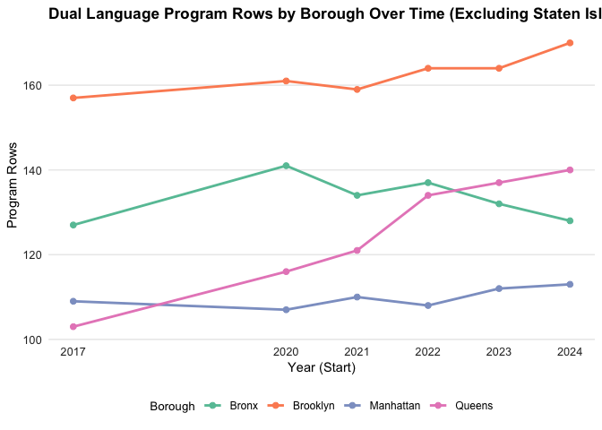
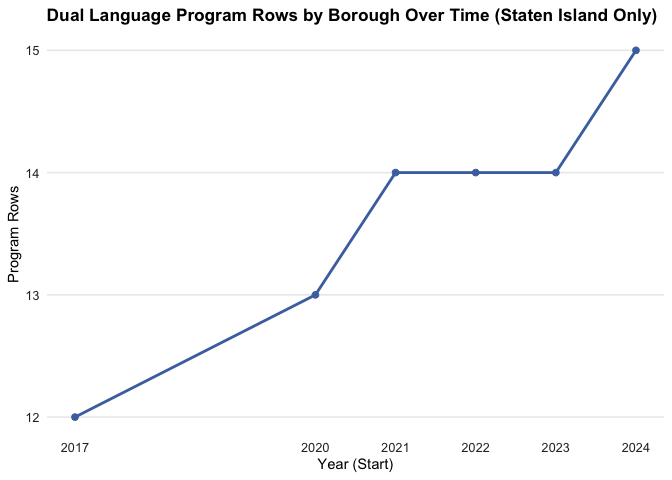
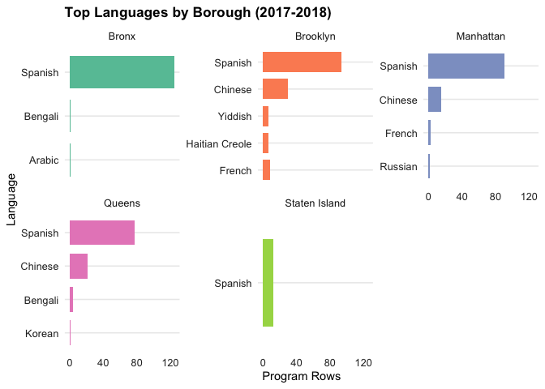
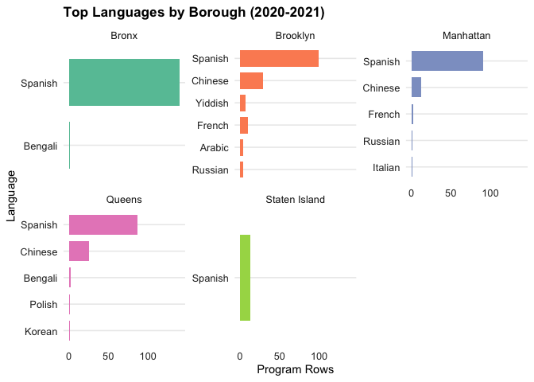
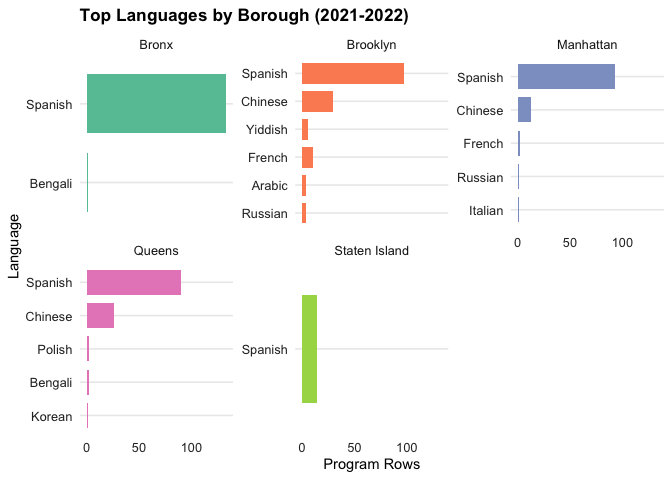
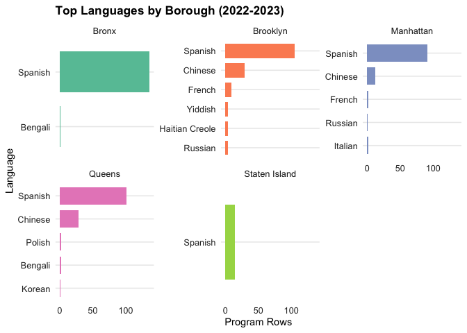
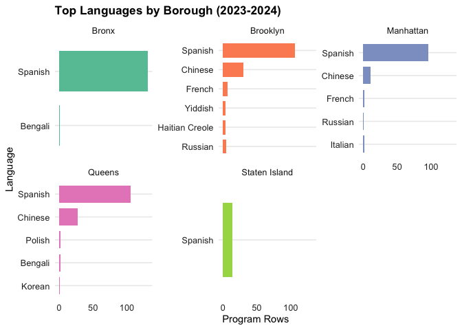
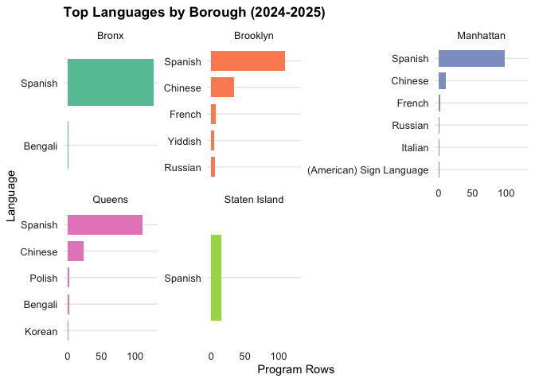

# Dual Language Programs in NYC Public Schools between 2017-2024
- author: "Tomonori Nagano"
- date: "2026-01-20"

<style>
analysis-alt {
  font-family: "Georgia", serif;
  font-size: 12pt;
  line-height: 1.6;
  background: #f6f3e9;
  border-left: 4px solid #c49a6c;
  padding: 12px 12px 6px 12px;
  margin: 4px 0 16px 0;
}
</style>

## Introduction

This analysis compares bilingual/dual language programs available across five boroughs of New York City between 2017-2024.

## Data

<div class="analysis-alt">
<b>My comments</b>: Data about bilingual/dual language programs are available on the NYC Open Data (between 2017-2021) and on the NYC DOE InfoHub (after 2022).
</div>

Raw program lists and LEP language counts are loaded from these project files:

- DOE bilingual/dual language program list for SY 2017-2018 (CSV; DBN-level).
	- `data/raw/anticipated_bilingual_programs_2017_2018.csv`  
	- Source: https://data.cityofnewyork.us/d/ydbx-4ufw  
- DOE bilingual program list for SY 2020-2021
	- `data/raw/bilingual_program_list_2020_2021.csv`  
	- Source: https://data.cityofnewyork.us/d/rrd7-vuvp  
- DOE bilingual program list for SY 2021-2022
	- `data/raw/bilingual_program_list_2021_2022.csv`  
	- Source: https://data.cityofnewyork.us/d/6iwb-7euj
- DOE bilingual program list for SY 2022-2023
	- `data/raw/bilingual-program-list_2022_2023.xlsx`
	- Source (use Internet Archive for the page archive in 2022): https://infohub.nyced.org/in-our-schools/programs/english-language-learners-programs-and-services	
- DOE bilingual program list for SY 2023-2024
	- `data/raw/bilingual-program-list_2023_2024.xlsx`  
	- Source (use Internet Archive for the page archive in 2023): https://infohub.nyced.org/in-our-schools/programs/english-language-learners-programs-and-services
- DOE bilingual program list for SY 2024-2025
	- `data/raw/bilingual-program-list_2024_2025.xlsx`  
	- Source: https://infohub.nyced.org/in-our-schools/programs/english-language-learners-programs-and-services

Data notes:

- File formats vary by year (CSV vs Excel); column names and available fields change across releases.
- The 2017-2018 file uses DBN and requires borough extraction from DBN for borough-level analysis.
- Later years include district/borough fields directly but still need normalization for consistent trend analysis.


## Analysis Scripts

``` r
program_2017_2018 <- read_csv("data/raw/anticipated_bilingual_programs_2017_2018.csv")
program_2020_2021 <- read_csv("data/raw/bilingual_program_list_2020_2021.csv")
program_2021_2022 <- read_csv("data/raw/bilingual_program_list_2021_2022.csv")
program_2022_2023 <- read_xlsx("data/raw/bilingual-program-list_2022_2023.xlsx")
program_2023_2024 <- read_xlsx("data/raw/bilingual-program-list_2023_2024.xlsx")
program_2024_2025 <- read_xlsx("data/raw/bilingual-program-list_2024_2025.xlsx")

program_2017_2018 <- program_2017_2018 %>% mutate(SourceYear = "2017-2018")
program_2020_2021 <- program_2020_2021 %>% mutate(SourceYear = "2020-2021")
program_2021_2022 <- program_2021_2022 %>% mutate(SourceYear = "2021-2022")
program_2022_2023 <- program_2022_2023 %>% mutate(SourceYear = "2022-2023")
program_2023_2024 <- program_2023_2024 %>% mutate(SourceYear = "2023-2024")
program_2024_2025 <- program_2024_2025 %>% mutate(SourceYear = "2024-2025")
```

- Data normalization process is omitted in the knit document. See the source RMarkdown for the normaliztaion procedures.


<div style="height:40px"></div>
### Overall numbers
<div class="analysis-alt">
<b>My comments</b>: The number of bilingual/dual language programs continued to grow between 2017 and 2024. This was a little bit surprising given a series of setbacks that DOE and bilingual/dual language programs experienced, particularly after 2020, such as COVID-19 and the Times' podcast series "Nice White Parents" in 2020.
</div>

- Count total program rows by year to show overall volume trends.


``` r
program_counts <- programs_all %>%
  count(SourceYear, name = "ProgramRows") %>%
  arrange(SourceYear)

program_counts
```

```
## # A tibble: 6 × 2
##   SourceYear ProgramRows
##   <chr>            <int>
## 1 2017-2018          508
## 2 2020-2021          538
## 3 2021-2022          538
## 4 2022-2023          557
## 5 2023-2024          559
## 6 2024-2025          566
```

- Tabulate program rows by language and year, then display the top 5 languages per year.

``` r
language_by_year <- programs_all %>%
  filter(!is.na(language), !is.na(year_start)) %>%
  count(year_start, language, name = "ProgramRows") %>%
  arrange(year_start, desc(ProgramRows))
```

- Save language-by-year counts to CSV for downstream use.

``` r
write_csv(language_by_year, file.path(output_dir, "language_by_year.csv"))
```

- Pivot language counts into a wide year-by-language table.

``` r
language_by_year_table <- language_by_year %>%
  tidyr::pivot_wider(
    names_from = language,
    values_from = ProgramRows,
    values_fill = 0
  ) %>%
  arrange(year_start)
```


<div style="height:40px"></div>
### By languages
<div class="analysis-alt">
<b>My comments</b>: The growth of bilingual/dual language programs (DLP) between 2017 and 2024 is primarily due to the increase in DLP in Spanish. In fact, most languages either lost programs (such as French, Bengali, and Haitian Creole) or lost all programs (such as Hebrew and Japanese). Chinese, which is spoken by about 7% of the total NYC population, did not see much increase during this period. Spanish, which is spoken by about 24% of the total NYC population, is the primary source of the increase in DLP programs over the past decade.
</div>

- Transpose the table to show all languages as rows and years as columns.

``` r
language_by_year_table_t <- language_by_year_table %>%
  tibble::column_to_rownames("year_start") %>%
  t() %>%
  as.data.frame()

language_by_year_table_t
```

```
##                          2017 2020 2021 2022 2023 2024
## Spanish                   399  430  427  447  452  460
## Chinese                    66   66   68   69   68   68
## French                     10   12   12   11    9    9
## Bengali                     6    4    5    5    5    5
## Haitian Creole              6    3    3    4    4    3
## Yiddish                     6    7    6    4    4    4
## Arabic                      5    4    4    3    2    2
## Russian                     5    5    5    5    6    6
## Hebrew                      1    0    0    0    0    0
## Japanese                    1    1    1    1    0    0
## Korean                      1    1    1    1    1    1
## Polish                      1    2    3    3    3    3
## Urdu                        1    0    0    0    0    0
## Italian                     0    3    3    4    5    4
## (American) Sign Language    0    0    0    0    0    1
```

- Save the year-by-language table to CSV.

``` r
write_csv(language_by_year_table, file.path(output_dir, "year_by_language.csv"))
```

<div class="analysis-alt">
<b>My comments</b>: If you plot the data, the difference between Spanisn and the other languages becomes more obvious.
</div>

- Plot top languages over time to visualize trends.

``` r
spanish <- language_by_year %>%
  filter(language == "Spanish")

ggplot(spanish, aes(x = year_start, y = ProgramRows)) +
  geom_line(color = "#1b9e77", linewidth = 1) +
  geom_point(color = "#1b9e77", size = 2) +
  scale_x_continuous(breaks = sort(unique(language_by_year$year_start))) +
  labs(
    title = "Program Rows by Year (Spanish)",
    x = "Year (Start)",
    y = "Program Rows"
  )
```

<!-- -->

``` r
language_by_year %>%
  filter(language != "Spanish") %>%
  ggplot(aes(x = year_start, y = ProgramRows, color = language)) +
  geom_line(linewidth = 1) +
  geom_point(size = 2) +
  scale_x_continuous(breaks = sort(unique(language_by_year$year_start))) +
  scale_color_brewer(palette = "Dark2", na.value = "grey70") +
  labs(
    title = "Program Rows by Language Over Time (All Non-Spanish Languages)",
    x = "Year (Start)",
    y = "Program Rows",
    color = "Language"
  )
```

<!-- -->

- Count languages by borough and year, then list top 5 per borough.

``` r
language_by_borough <- programs_all %>%
  filter(!is.na(borough), !is.na(language)) %>%
  count(SourceYear, borough, language, name = "ProgramRows") %>%
  arrange(SourceYear, borough, desc(ProgramRows))
```

- Save language-by-borough counts to CSV.

``` r
write_csv(language_by_borough, file.path(output_dir, "language_by_borough.csv"))
```

- Count total program rows by borough over time.

``` r
borough_by_year <- programs_all %>%
  filter(!is.na(borough), !is.na(year_start)) %>%
  count(year_start, borough, name = "ProgramRows") %>%
  arrange(year_start, borough)
```

- Save borough-by-year counts to CSV.

``` r
write_csv(borough_by_year, file.path(output_dir, "borough_by_year.csv"))
```

<div style="height:40px"></div>
### By boroughs
<div class="analysis-alt">
<b>My comments</b>: In terms of boroughs, Queens has led the growth of bilingual/dual language programs (DLPs) in the past decade. Brooklyn was known as the hub of DLPs until 2020, but its growth has stalled since then (maybe because of the Nice White Parents). The Bronx had a major increase between 2017 and 2020, but it has experienced a declining trend since then (maybe because of COVID-19). It's not entirely clear why Queens never experienced the setback that Brooklyn and the Bronx experienced in 2020. Staten Island has a very small number of DLPs, but the number is slowly increasing.
</div>

- Pivot borough counts into a wide year-by-borough table.

``` r
borough_by_year_table <- borough_by_year %>%
  tidyr::pivot_wider(
    names_from = borough,
    values_from = ProgramRows,
    values_fill = 0
  ) %>%
  arrange(year_start)

borough_by_year_table
```

```
## # A tibble: 6 × 6
##   year_start Bronx Brooklyn Manhattan Queens `Staten Island`
##        <int> <int>    <int>     <int>  <int>           <int>
## 1       2017   127      157       109    103              12
## 2       2020   141      161       107    116              13
## 3       2021   134      159       110    121              14
## 4       2022   137      164       108    134              14
## 5       2023   132      164       112    137              14
## 6       2024   128      170       113    140              15
```

- Save the year-by-borough table to CSV.

``` r
write_csv(borough_by_year_table, file.path(output_dir, "year_by_borough.csv"))
```

- Plot program rows by borough over time.

``` r
borough_by_year %>%
  filter(borough != "Staten Island") %>%
  ggplot(aes(x = year_start, y = ProgramRows, color = borough)) +
  geom_line(linewidth = 1) +
  geom_point(size = 2) +
  scale_x_continuous(breaks = sort(unique(borough_by_year$year_start))) +
  scale_color_brewer(palette = "Set2") +
  labs(
    title = "Dual Language Program Rows by Borough Over Time (Excluding Staten Island)",
    x = "Year (Start)",
    y = "Program Rows",
    color = "Borough"
  )
```

<!-- -->


``` r
borough_by_year %>%
  filter(borough == "Staten Island") %>%
  ggplot(aes(x = year_start, y = ProgramRows)) +
  geom_line(linewidth = 1, color = "#4c72b0") +
  geom_point(size = 2, color = "#4c72b0") +
  scale_x_continuous(breaks = sort(unique(borough_by_year$year_start))) +
  labs(
    title = "Dual Language Program Rows by Borough Over Time (Staten Island Only)",
    x = "Year (Start)",
    y = "Program Rows"
  )
```

<!-- -->

<div style="height:40px"></div>
### Languages in each borough
<div class="analysis-alt">
<b>My comments</b>: Almost all DLP programs in the Bronx are Spanish (the only non-Spanish DLP in the Bronx is one Bengali DLP). The loss of DLP in the Bronx in the last decade is particularly perplexing since there was a major growth in Spanish DLP overall during the same period. Brooklyn reflects the general trend of DLP in NYC such that there was an increase in Spanish DLP while DLP programs in other languages were lost. Overall, Brooklyn has more DLP programs, but they are less diverse in terms of languages. In Manhattan, there was not much change in the last decade except that there was some increase in Spanish DLP and a decrease in Chinese DLP. Queens has seen a major increase of Spanish DLP — there were 77 Spanish DLP in 2017, which grew to 111 in 2024. There has been little change in Staten Island.
</div>

- Plot top languages by borough for the latest year.

``` r
years <- sort(unique(language_by_borough$SourceYear))

for (yr in years) {
  plot_data <- language_by_borough %>%
    filter(SourceYear == yr) %>%
    group_by(borough) %>%
    slice_max(ProgramRows, n = 5) %>%
    ungroup()

  p <- ggplot(plot_data, aes(x = reorder(language, ProgramRows), y = ProgramRows, fill = borough)) +
    geom_col(show.legend = FALSE, width = 0.75) +
    coord_flip() +
    facet_wrap(~ borough, scales = "free_y") +
    scale_fill_brewer(palette = "Set2") +
    labs(
      title = paste("Top Languages by Borough (", yr, ")", sep = ""),
      x = "Language",
      y = "Program Rows"
    )

  print(p)
}
```

<!-- --><!-- --><!-- --><!-- --><!-- --><!-- -->

- Table view of top languages by borough for each year.

``` r
boroughs <- sort(unique(language_by_borough$borough))

for (b in boroughs) {
  table_data <- language_by_borough %>%
    filter(borough == b) %>%
    select(SourceYear, language, ProgramRows) %>%
    tidyr::pivot_wider(
      names_from = language,
      values_from = ProgramRows,
      values_fill = 0
    ) %>%
    arrange(SourceYear)

  cat("\n\nBorough: ", b, "\n\n", sep = "")
  print(table_data)
}
```

```
## 
## 
## Borough: Bronx
## 
## # A tibble: 6 × 4
##   SourceYear Spanish Arabic Bengali
##   <chr>        <int>  <int>   <int>
## 1 2017-2018      125      1       1
## 2 2020-2021      140      0       1
## 3 2021-2022      133      0       1
## 4 2022-2023      136      0       1
## 5 2023-2024      131      0       1
## 6 2024-2025      127      0       1
## 
## 
## Borough: Brooklyn
## 
## # A tibble: 6 × 14
##   SourceYear Spanish Chinese French `Haitian Creole` Yiddish Arabic Russian
##   <chr>        <int>   <int>  <int>            <int>   <int>  <int>   <int>
## 1 2017-2018       94      30      8                6       6      4       4
## 2 2020-2021       99      29     10                3       7      4       4
## 3 2021-2022       97      29     10                3       6      4       4
## 4 2022-2023      105      29      9                4       4      3       4
## 5 2023-2024      106      30      7                4       4      2       5
## 6 2024-2025      109      34      7                3       4      2       5
## # ℹ 6 more variables: Bengali <int>, Hebrew <int>, Japanese <int>,
## #   Polish <int>, Urdu <int>, Italian <int>
## 
## 
## Borough: Manhattan
## 
## # A tibble: 6 × 7
##   SourceYear Spanish Chinese French Russian Italian `(American) Sign Language`
##   <chr>        <int>   <int>  <int>   <int>   <int>                      <int>
## 1 2017-2018       91      15      2       1       0                          0
## 2 2020-2021       91      12      2       1       1                          0
## 3 2021-2022       93      13      2       1       1                          0
## 4 2022-2023       91      12      2       1       2                          0
## 5 2023-2024       96      11      2       1       2                          0
## 6 2024-2025       98      10      2       1       1                          1
## 
## 
## Borough: Queens
## 
## # A tibble: 6 × 6
##   SourceYear Spanish Chinese Bengali Korean Polish
##   <chr>        <int>   <int>   <int>  <int>  <int>
## 1 2017-2018       77      21       4      1      0
## 2 2020-2021       87      25       2      1      1
## 3 2021-2022       90      26       2      1      2
## 4 2022-2023      101      28       2      1      2
## 5 2023-2024      105      27       2      1      2
## 6 2024-2025      111      24       2      1      2
## 
## 
## Borough: Staten Island
## 
## # A tibble: 6 × 2
##   SourceYear Spanish
##   <chr>        <int>
## 1 2017-2018       12
## 2 2020-2021       13
## 3 2021-2022       14
## 4 2022-2023       14
## 5 2023-2024       14
## 6 2024-2025       15
```

## Output

Outputs are written to `output` and include:

- `language_by_year.csv`
- `year_by_language.csv`
- `language_by_borough.csv`
- `borough_by_year.csv`
- `year_by_borough.csv`
- `language_by_borough_district.csv`
